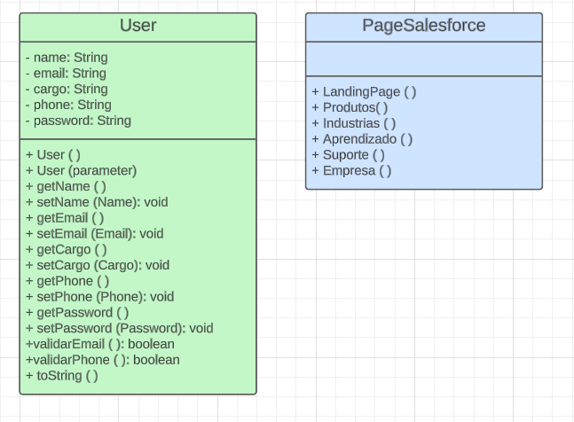

# fiap_challenge

## Definição do Projeto em Java
Decidimos desenvolver um sistema de registro com a classe "User", que inclui atributos essenciais, como nome, e-mail e senha, entre outros. O propósito principal é permitir o armazenamento e validação dos dados do usuário. Além disso, criamos a classe "PageSalesforce" para funcionar como um menu intuitivo. Esse menu oferece uma experiência de navegação fácil e eficaz para os usuários registrados, permitindo-lhes acessar informações

