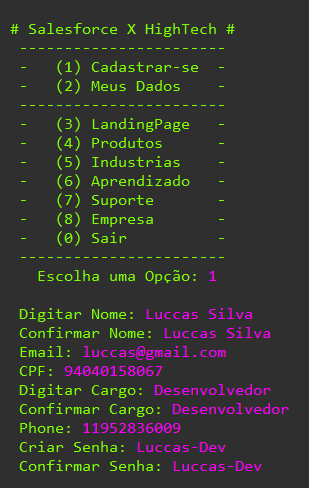
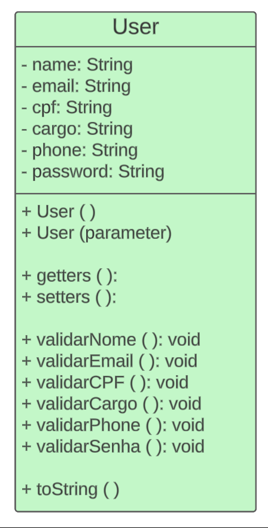
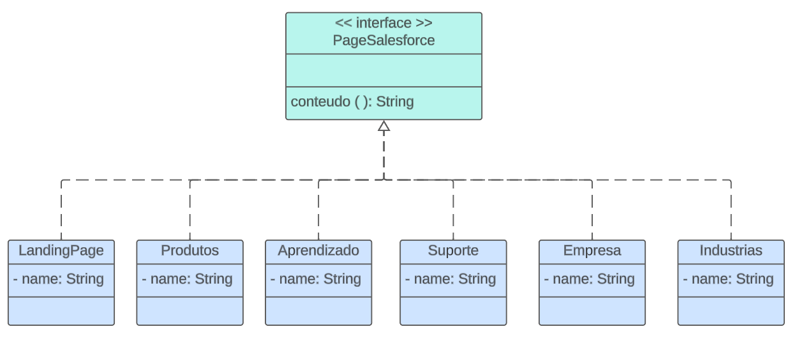

# fiap_challenge

## Definição do Projeto em Java
Decidimos desenvolver um sistema de registro focado na classe "User", incorporando atributos cruciais como nome, e-mail, CPF, telefone e senha, além de outros elementos essenciais. O objetivo principal é possibilitar a coleta e validação eficientes dos dados do usuário. Com o intuito de aprimorar a experiência do usuário, elaboramos um menu intuitivo e funcional que simplifica a navegação, oferecendo acesso fácil às informações das páginas do Salesforce.

## Fluxo de uso do console

  

## Diagrama de Classes

  
  
  

